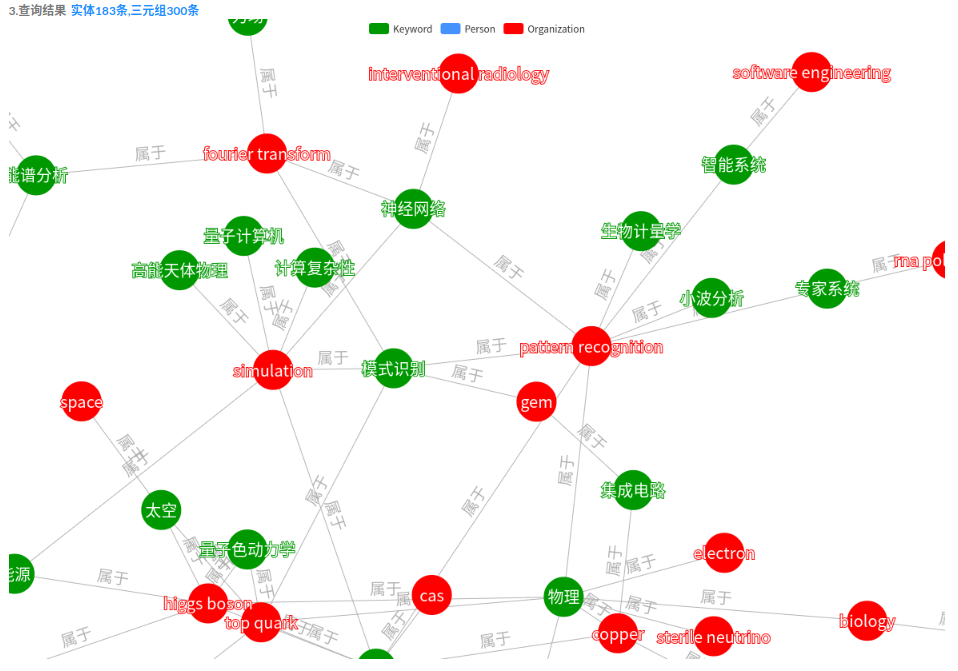
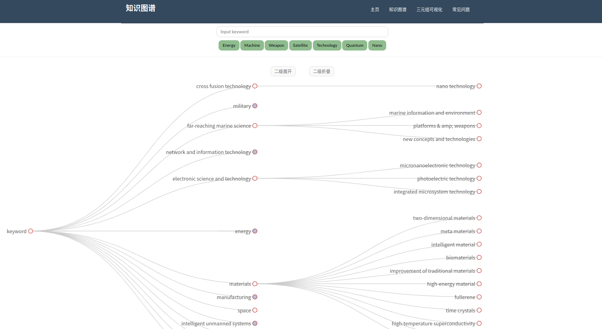
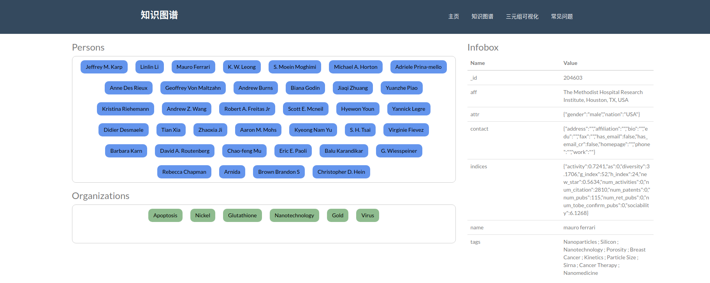

# triplesKB
==========

[](https://www.apache.org/licenses/LICENSE-2.0.html)

*****

**triplesKB 是一个自动构建特定领域三元组知识库的工具.遵循Apache 2.0协议.**

### Background

> 项目需求:根据给定的军事科技词词表,构建特定领域的人员与机构信息,并关联成三元组形式

### Idea


### Environment

> python 3.x
>
> flask 1.x
>
> mongodb v3.6.3
>
> echarts 3.0

### Directory
```
├── data                  保存最终的采集数据
│   ├── organizations
│   └── persons
└── web                             部署到Web服务器
└── src
   ├── aminer_crawler     Aminer爬虫
   ├── baike_crawler       百科爬虫
   │   └── data                 保存中间采集数据
   ├── dict                        关键字,人员,机构生成的id字典
   ├── scholar_crawler    学术爬虫
   │   ├── data
   │   ├── proxy_hellper   代理池工具
   │   └── util
   └── triples                    保存三元组
```
### Result

```python
python server.py  #启动flask服务器
```


1.关键词与关键词的部分关系元组可视化如图所示,绿色节点表示关键词,节点之间的关系包含:上级,下级,同领域,无关系四种.

2.人员与关键词的部分关系元组可视化如图所示,绿色节点表示关键词,蓝色节点表示人员,有边相连表示人员属于该领域.

3.机构与关键词的部分关系元组可视化如图所示,绿色节点表示关键词,红色节点表示机构,有边相连表示机构属于该领域.

4.人员与机构的部分关系元组可视化如图所示,蓝色节点表示人员,红色节点表示机构,有边相连表示人员属于该机构.

5.知识图谱搜索


6.查询关键字结果




### Reference

- [spider](https://github.com/jasonhavend/DJH-Spider)
